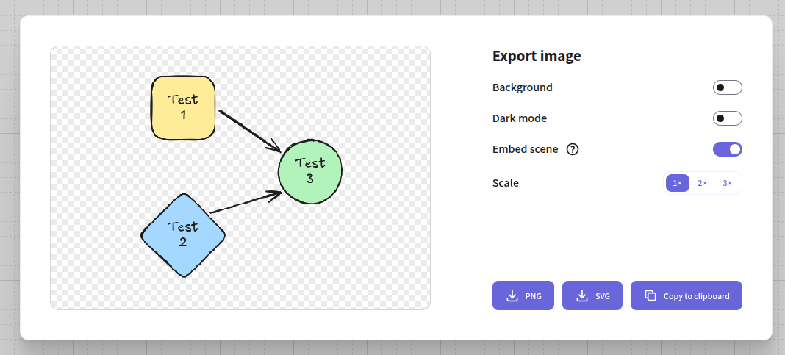
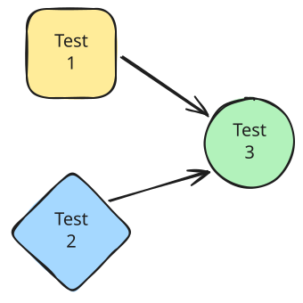

# ExcaliDraw

## What is ExcaliDraw???

For those unfamiliar with [ExcaliDraw](https://github.com/excalidraw/excalidraw), it is a [WYSIWYG editor](https://en.wikipedia.org/wiki/WYSIWYG) for limited [Mermaid](https://mermaid.js.org/intro/)-like [Graph/Flowchart](https://mermaid.js.org/syntax/flowchart.html) type diagrams with a hand drawn [Look and Feel(Laf)](https://en.wikipedia.org/wiki/Look_and_feel).
It is similar to the [Mermaid Live Editor](https://mermaid.live/).

## How do I use this cool tool???, the Easy BUtton remix

The images in the [Gallery](../assets/images/ExcaliDraw/index.md) were exported with the _Embed scene_ option enabled like this:

If you open [ExcaliDraw](http://ExcaliDraw.com) in a new window, then you can drag and drop the image below and edit it.

Once you are finished, then select the _Export image..._ option from the hamburger menu in the upper-left corner of the canvas (or just _Ctrl+Shift+E_) where you can save it as a `.png` or `.svg` file.
The `.svg` format lets you zoom in on the image without it pixelating, but the `.png` format is more widely supported.
Don't forget to enable the _Embed scene_ option so that you can edit your image later if needed.
Keep in mind the embedded scene metadata is stripped from the image when they are shared via some tools (e.g. Slack), so EMail attachments are good if they can't be downloaded directly.
