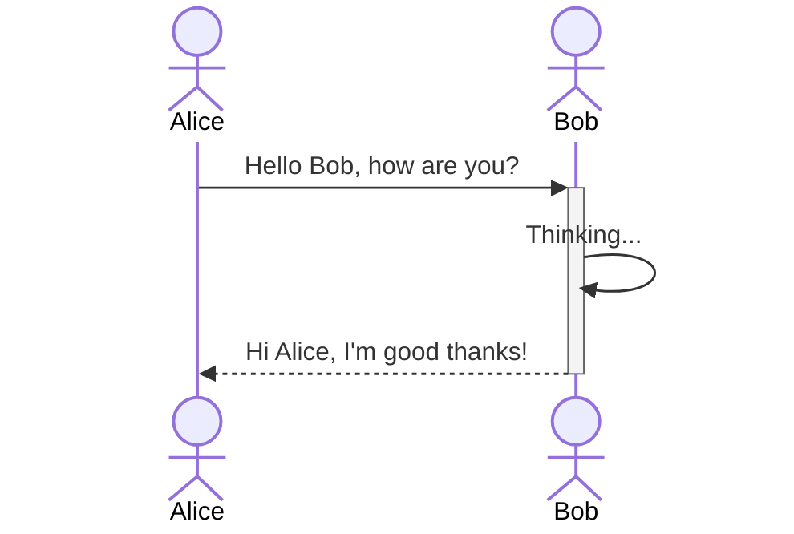
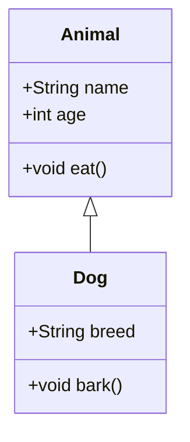
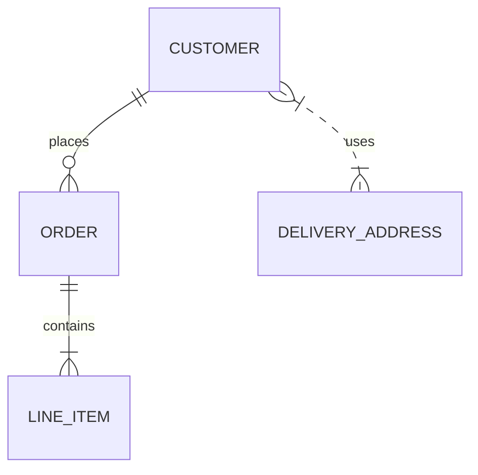

# Mermaid Diagrams
Mermaid is a powerful tool for creating diagrams and visualizations using a simple markdown-like syntax.
It allows you to create flowcharts, sequence diagrams, class diagrams, and more.
Below are some examples of Mermaid diagrams which use the Hand Drawn style with the Excalifont(s) for a more informal and visually appealing look.

## Sequence Diagram


## Flowchart

```mermaid
%% Example Flowchart
flowchart TD
    classDef fillBlack fill:#000
    classDef fillBrown fill:#c96
    classDef fillRed fill:#fcc
    classDef fillOrange fill:#fc9
    classDef fillYellow fill:#ffc
    classDef fillGreen fill:#cfc
    classDef fillAqua fill:#cff
    classDef fillBlue fill:#69f
    classDef fillViolet fill:#ccf
    classDef fillGray fill:#ccc
    classDef fillWhite fill:#fff

    A[Start]:::fillGreen
    B{Is it sunny?}:::fillViolet
    C[Go for a walk]:::fillYellow
    D[Stay indoors]:::fillBlue
    E[/Enjoy the sunshine!\]:::fillOrange
    F[\Find something fun to do inside!/]:::fillAqua
    G((End)):::fillRed
    A --> B
    B --> C
    B --> D
    C --> E
    D --> F
    E --> G
    F --> G  
```


## Class Diagram


## Entity Relationship Diagram


## MkDocs Integrations

In order to force the first diagram on each page to render properly, I had to add a section to the [mkdocs_hooks.py](../assets/scripts/mkdocs_hooks.py) and a [mermaid-init.js](../assets/javascripts/mermaid-init.js).
These files force a fake blank diagram on the page and to wait for the fonts to fully load before any rendering or sizing is done on the first real diagram.

- [mkdocs_hooks.py](../assets/scripts/mkdocs_hooks.py):
```python
--8<-- "./assets/scripts/mkdocs_hooks.py"
```

- [mermaid-init.js](../assets/javascripts/mermaid-init.js):
```javascript
--8<-- "./assets/javascripts/mermaid-init.js"
```
